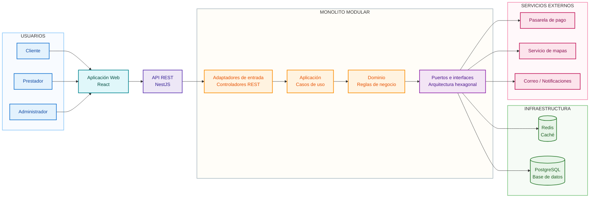
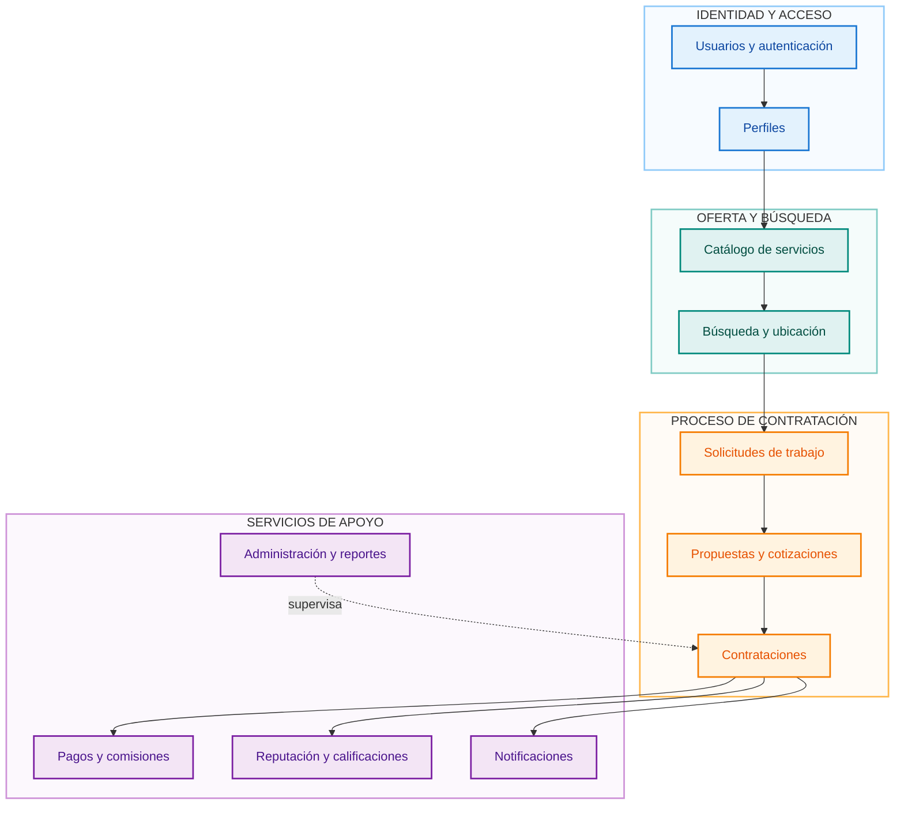
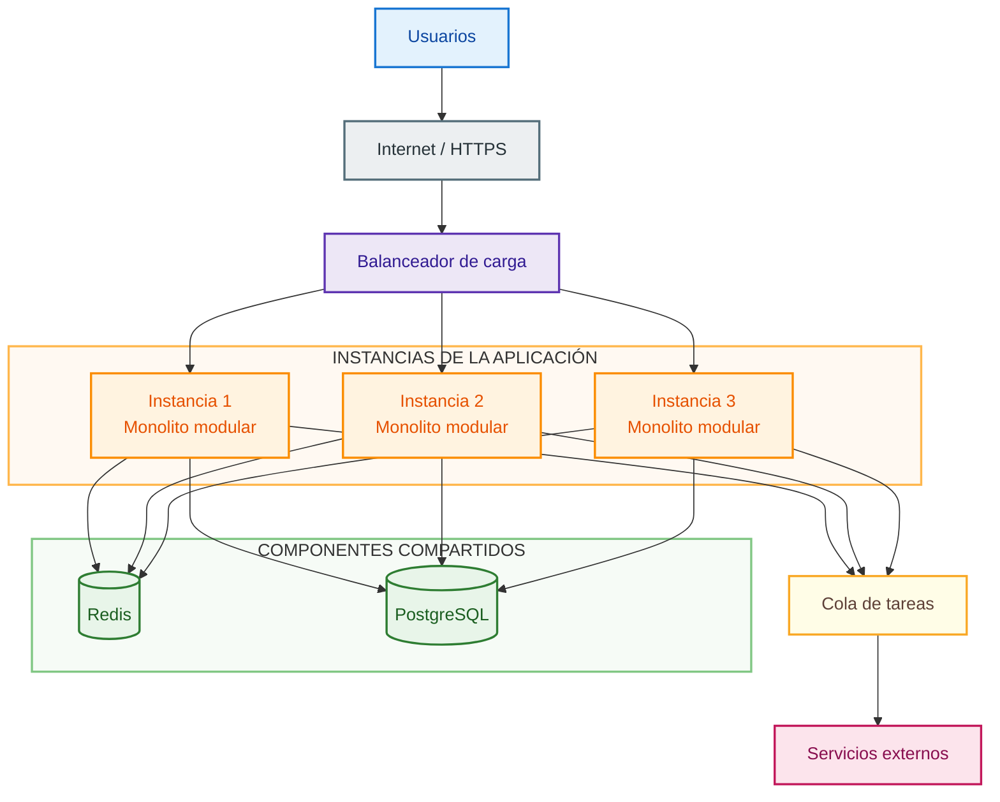
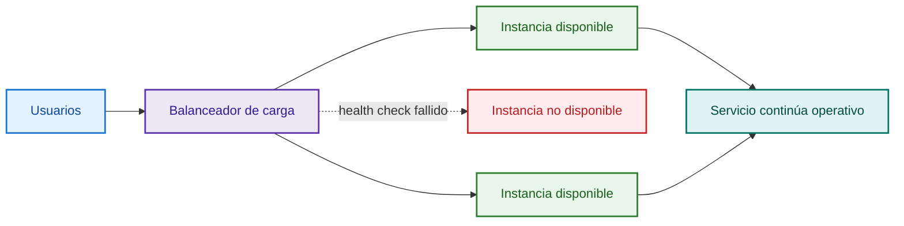
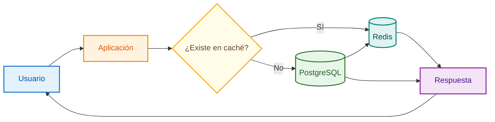
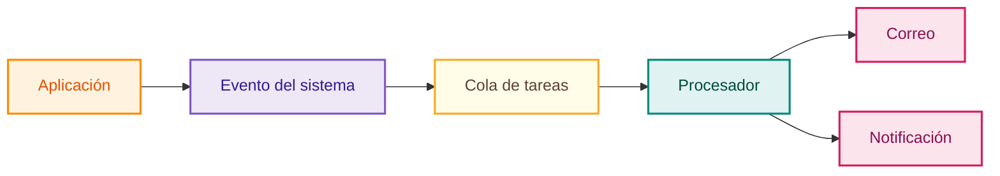

# Análisis de Caso – Arquitectura de Software

## Proyecto

**Plataforma digital para la oferta, búsqueda y contratación de servicios técnicos, profesionales y de oficios en Ayacucho, 2026**

---

## 1. Arquitectura seleccionada

Para el desarrollo del sistema se propone una **arquitectura de monolito modular con principios de arquitectura hexagonal**.

La solución se implementará inicialmente como una sola aplicación desplegable, pero estará organizada internamente en módulos con responsabilidades claramente definidas. Esta decisión permite mantener una primera versión manejable, evitando la complejidad prematura de los microservicios, pero dejando al sistema preparado para crecer y evolucionar de manera progresiva.

La arquitectura se orienta a cumplir principalmente con los siguientes objetivos:

- Separar la lógica del negocio de la infraestructura tecnológica.
- Facilitar el mantenimiento y la evolución del sistema.
- Mejorar el rendimiento de las operaciones frecuentes.
- Permitir escalamiento horizontal cuando la demanda aumente.
- Reducir el riesgo de caída total ante fallos parciales.
- Facilitar la integración con servicios externos.
- Permitir una futura aplicación móvil reutilizando la misma API.

La solución se diseña considerando inicialmente hasta **20 000 usuarios registrados**. La cantidad real de usuarios concurrentes deberá comprobarse posteriormente mediante pruebas de carga.

---

## 2. Drivers arquitectónicos

Los principales drivers arquitectónicos del sistema son los siguientes:

| Driver | Necesidad | Decisión arquitectónica |
|---|---|---|
| Escalabilidad | Permitir crecimiento progresivo de usuarios y solicitudes | Escalamiento horizontal |
| Disponibilidad | Evitar la caída total por falla de un componente | Varias instancias y balanceador |
| Rendimiento | Mantener respuestas rápidas en búsquedas y consultas | Caché con Redis |
| Resiliencia | Continuar operando ante fallos parciales | Desacoplamiento y procesamiento asíncrono |
| Seguridad | Proteger cuentas, datos y operaciones | Autenticación, autorización y HTTPS |
| Mantenibilidad | Facilitar cambios y nuevas funciones | Monolito modular |
| Integración | Conectar pagos, mapas y notificaciones | Adaptadores externos |
| Extensibilidad | Permitir nuevos clientes y futuras integraciones | API REST y puertos |

---

## 3. Vista general de la arquitectura

La plataforma se organiza en una vista general compuesta por usuarios, cliente web, API de entrada, núcleo del sistema, infraestructura y servicios externos.

### Interpretación

Los usuarios acceden al sistema a través de una aplicación web desarrollada en React. Esta aplicación consume una API REST construida con NestJS. La lógica principal se encuentra en el monolito modular, donde se separan claramente los controladores de entrada, los casos de uso, el dominio y los puertos de salida. A través de estos puertos se realiza la comunicación con la infraestructura y con los servicios externos.

---

## 4. Organización interna del monolito modular

La arquitectura interna del monolito se divide en módulos funcionales.

### Módulos principales

**Usuarios y autenticación**  
Gestiona registro, inicio de sesión, roles, permisos y recuperación de acceso.

**Perfiles**  
Administra la información de clientes y prestadores, incluyendo especialidad, experiencia, ubicación y disponibilidad.

**Catálogo de servicios**  
Gestiona categorías, subcategorías y servicios ofrecidos por los prestadores.

**Búsqueda y ubicación**  
Permite filtrar y localizar prestadores o servicios por diferentes criterios.

**Solicitudes de trabajo**  
Permite a los clientes publicar los trabajos que necesitan realizar.

**Propuestas y cotizaciones**  
Gestiona las propuestas enviadas por los prestadores a partir de las solicitudes.

**Contrataciones**  
Controla el ciclo principal de contratación y seguimiento del servicio.

**Pagos y comisiones**  
Gestiona los pagos y la comisión correspondiente a la plataforma.

**Reputación y calificaciones**  
Permite registrar comentarios y valoraciones después de la prestación del servicio.

**Notificaciones**  
Administra avisos y alertas relacionados con el flujo del negocio.

**Administración y reportes**  
Permite supervisar usuarios, contenido, incidencias y reportes administrativos.

---

## 5. Aplicación de la arquitectura hexagonal

El objetivo de la arquitectura hexagonal es mantener la lógica principal del negocio independiente de tecnologías externas o proveedores específicos.

```mermaid
flowchart LR

    E["Adaptador de entrada<br/>API REST"]
    CU["Caso de uso"]
    D["Dominio"]
    P["Puerto de salida"]
    AD["Adaptador externo"]
    SX["Servicio externo"]

    E --> CU
    CU --> D
    D --> P
    P --> AD
    AD --> SX

    classDef in fill:#E3F2FD,stroke:#1976D2,color:#0D47A1,stroke-width:2px;
    classDef core fill:#FFF3E0,stroke:#FB8C00,color:#E65100,stroke-width:2px;
    classDef port fill:#F3E5F5,stroke:#8E24AA,color:#4A148C,stroke-width:2px;
    classDef adapter fill:#E8F5E9,stroke:#43A047,color:#1B5E20,stroke-width:2px;
    classDef ext fill:#FCE4EC,stroke:#D81B60,color:#880E4F,stroke-width:2px;

    class E in;
    class CU,D core;
    class P port;
    class AD adapter;
    class SX ext;
```

En esta arquitectura, la lógica principal no depende directamente de la implementación de una pasarela de pago, un servicio de mapas o un sistema de notificaciones. En su lugar, se define un puerto o interfaz, y luego un adaptador concreto se encarga de comunicarse con la tecnología externa correspondiente.

---

## 6. Vista de despliegue y escalabilidad

Cuando la demanda aumente, la plataforma podrá escalar horizontalmente.

### Explicación

La primera versión del sistema puede funcionar con una sola instancia. Sin embargo, cuando aumente la demanda, podrán agregarse nuevas instancias del mismo monolito modular. Un balanceador de carga distribuirá las solicitudes entre ellas. Este enfoque permite crecimiento progresivo sin rediseñar completamente la lógica principal.

---

## 7. Alta disponibilidad y resiliencia

La arquitectura busca evitar que la falla de una sola instancia provoque la caída total del servicio.

La resiliencia también aplica a los servicios secundarios. Si falla temporalmente el envío de correos o notificaciones, la búsqueda y contratación no deberían dejar de funcionar.

---

## 8. Estrategia de caché

Para mejorar el rendimiento de las consultas frecuentes se utilizará Redis.

### Datos candidatos para caché

- Categorías.
- Subcategorías.
- Configuraciones.
- Información pública consultada frecuentemente.
- Resultados de búsqueda reutilizables.

No toda la información debe almacenarse en caché. Los datos críticos o altamente cambiantes deberán obtenerse directamente de la fuente principal cuando sea necesario.

---

## 9. Procesamiento asíncrono

Algunas tareas del sistema no necesitan ejecutarse antes de responder al usuario. Por ejemplo:

- Envío de correos.
- Notificaciones.
- Procesos posteriores a una contratación.
- Generación de ciertos reportes.

Esto evita que operaciones secundarias aumenten innecesariamente el tiempo de respuesta de las operaciones principales.

---

## 10. Rendimiento

Como objetivo inicial, las búsquedas y consultas frecuentes deberán responder en un tiempo aproximado no mayor a **3 segundos en condiciones normales de operación**.

Para ello se consideran las siguientes estrategias:

- Uso de Redis como caché.
- Índices adecuados en PostgreSQL.
- Optimización de consultas.
- Paginación de resultados.
- Procesamiento asíncrono.
- Escalamiento horizontal cuando la demanda lo requiera.

El rendimiento real deberá validarse posteriormente mediante pruebas de carga.

---

## 11. Seguridad

La arquitectura considera los siguientes mecanismos de seguridad:

- Autenticación mediante tokens.
- Autorización basada en roles y permisos.
- Almacenamiento seguro de contraseñas.
- Comunicación cifrada mediante HTTPS.
- Validación de datos de entrada.
- Rate limiting.
- Protección de endpoints sensibles.
- Registro de operaciones críticas.

---

## 12. Persistencia de datos

Se propone utilizar **PostgreSQL** como base de datos principal.

La base de datos almacenará información relacionada con:

- Usuarios.
- Perfiles.
- Categorías.
- Servicios.
- Solicitudes.
- Propuestas.
- Contrataciones.
- Pagos.
- Comisiones.
- Calificaciones.
- Incidencias.
- Historial.

---

## 13. Tecnologías propuestas

| Componente | Tecnología propuesta |
|---|---|
| Frontend | React |
| Backend | Node.js + NestJS |
| API | REST |
| Base de datos | PostgreSQL |
| Caché | Redis |
| Autenticación | JWT |
| Documentación API | Swagger / OpenAPI |
| Contenedores | Docker |
| Control de versiones | Git y GitHub |

---

## 14. Justificación de la arquitectura

La elección de un **monolito modular** permite mantener una solución inicialmente sencilla de implementar y desplegar, sin caer en la complejidad operativa de los microservicios.

El uso de **principios de arquitectura hexagonal** permite desacoplar la lógica principal de los detalles de infraestructura, facilitando cambios futuros en proveedores o tecnologías.

La incorporación de **Redis** permite optimizar el rendimiento en operaciones de lectura frecuente.

El **escalamiento horizontal**, junto con un balanceador de carga, permitirá incrementar la capacidad del sistema a medida que la demanda aumente.

---

## 15. Conclusión

La arquitectura propuesta combina un **monolito modular con principios de arquitectura hexagonal**, proporcionando una base sólida para construir la plataforma de servicios en Ayacucho.

Esta propuesta favorece la mantenibilidad, el rendimiento, la escalabilidad, la disponibilidad y la integración con servicios externos, permitiendo además que el sistema evolucione progresivamente sin requerir un rediseño completo desde sus primeras etapas.