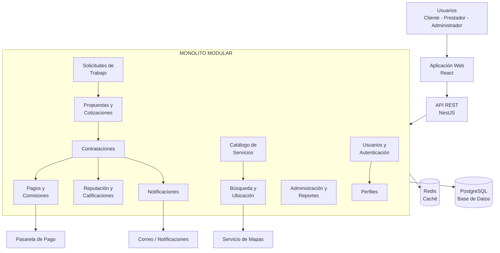
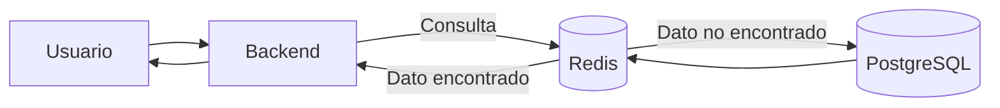
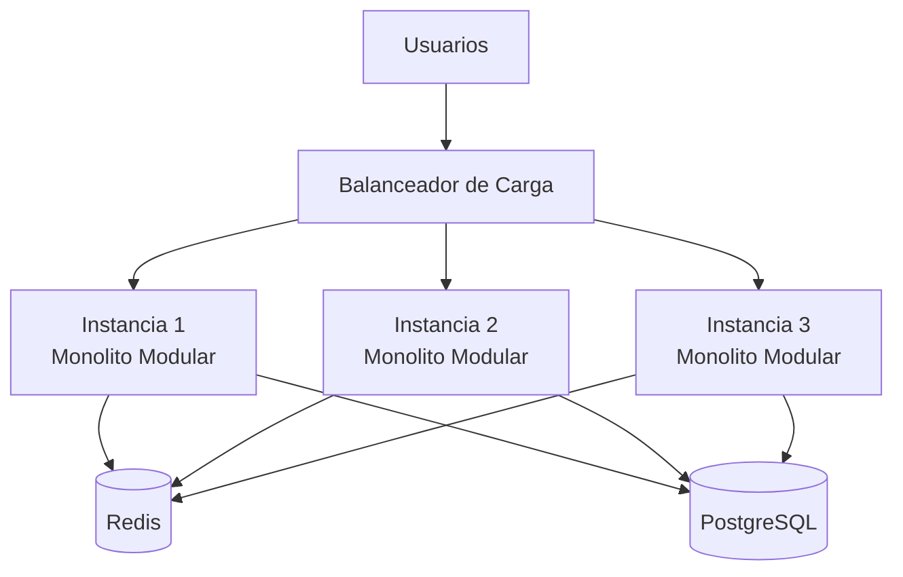
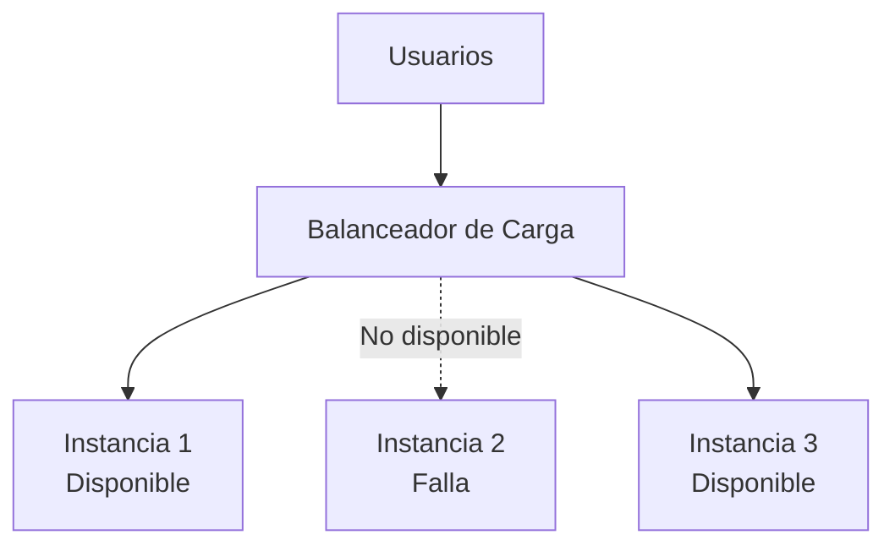
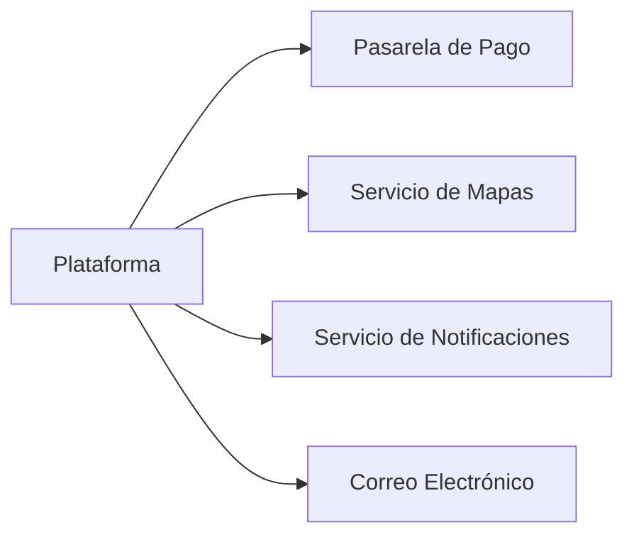

# Análisis de Caso – Arquitectura de Software

## 1. Arquitectura seleccionada

Para la plataforma digital de oferta, búsqueda y contratación de servicios técnicos, profesionales y de oficios se propone una **arquitectura de monolito modular con principios de arquitectura hexagonal**.

La aplicación se desarrollará inicialmente como una sola unidad desplegable, pero estará organizada internamente en módulos con responsabilidades claramente definidas.

Esta decisión permite mantener una implementación inicial manejable y evitar la complejidad prematura de los microservicios, sin impedir que la plataforma pueda evolucionar posteriormente.

---

## 2. Objetivo de la arquitectura

La arquitectura busca proporcionar una estructura que permita a la plataforma:

- Crecer progresivamente en número de usuarios.
- Mantener un buen rendimiento en búsquedas y consultas frecuentes.
- Evitar que una falla parcial provoque la caída completa del sistema.
- Facilitar el mantenimiento y la incorporación de nuevas funcionalidades.
- Integrarse con servicios externos sin acoplarlos directamente con la lógica principal.
- Permitir que una futura aplicación móvil utilice los mismos servicios del backend.

La solución se diseñará considerando inicialmente hasta **20 000 usuarios registrados**.

La cantidad real de usuarios conectados simultáneamente deberá validarse posteriormente mediante pruebas de carga.

---

## 3. Estilo arquitectónico

Se utilizará un **monolito modular**.

Aunque todos los módulos formarán parte de una misma aplicación, cada uno tendrá responsabilidades específicas y límites claramente definidos.

Los principios de arquitectura hexagonal permitirán mantener la lógica de negocio separada de tecnologías externas como PostgreSQL, Redis, pasarelas de pago, mapas y servicios de notificación.

---

## 4. Arquitectura lógica



---

## 5. Módulos principales

### Usuarios y autenticación

Responsable del registro, inicio de sesión, roles, permisos y recuperación de acceso.

### Perfiles

Gestiona la información de clientes y prestadores, incluyendo experiencia, especialidades, ubicación y disponibilidad.

### Catálogo de servicios

Administra categorías, subcategorías y servicios publicados por los prestadores.

### Solicitudes de trabajo

Permite a los clientes publicar trabajos que necesitan realizar.

### Propuestas y cotizaciones

Gestiona las propuestas económicas y condiciones enviadas por los prestadores.

### Contrataciones

Controla la aceptación de propuestas y el ciclo de vida del servicio contratado.

### Reputación y calificaciones

Gestiona comentarios y valoraciones posteriores a la finalización del servicio.

### Pagos y comisiones

Gestiona el registro de pagos y el cálculo de las comisiones correspondientes a la plataforma.

### Notificaciones

Gestiona avisos relacionados con propuestas, contrataciones y cambios de estado.

### Administración y reportes

Permite gestionar usuarios, categorías, incidencias, contenido reportado y consultas administrativas.

### Búsqueda y ubicación

Gestiona filtros, búsquedas de prestadores y servicios, y funciones relacionadas con ubicación geográfica.

---

## 6. Aplicación de arquitectura hexagonal

La arquitectura hexagonal permitirá separar la lógica principal del sistema de las tecnologías utilizadas para comunicarse con el exterior.

La lógica del negocio no dependerá directamente de PostgreSQL, Redis o de un proveedor específico de pagos.

Se utilizarán interfaces o puertos para definir las operaciones necesarias.

Por ejemplo:

```text
Lógica de negocio
       │
       ▼
Puerto de pagos
       │
       ▼
Adaptador
       │
       ▼
Pasarela de pago
```

De esta manera, una pasarela de pago podrá ser sustituida por otra sin modificar las reglas principales de contratación.

La misma estrategia podrá aplicarse a mapas, notificaciones, almacenamiento y otros servicios externos.

---

## 7. Caché

Se propone utilizar **Redis** como mecanismo de caché.

El objetivo es evitar consultas repetitivas hacia PostgreSQL para información que es solicitada frecuentemente y cambia con poca frecuencia.

Algunos datos candidatos para caché son categorías, subcategorías, configuraciones y determinados resultados reutilizables de búsqueda.



---

## 8. Escalabilidad

La primera versión podrá ejecutarse inicialmente como una sola instancia del monolito modular.

Si aumenta la cantidad de usuarios y solicitudes, la arquitectura permitirá desplegar varias instancias de la misma aplicación.

Un balanceador de carga distribuirá las solicitudes entre las instancias disponibles.



Esto corresponde a un mecanismo de **escalamiento horizontal**, ya que se incrementa la capacidad agregando nuevas instancias de la aplicación.

---

## 9. Alta disponibilidad y resiliencia

La arquitectura buscará reducir el riesgo de que una falla aislada provoque la indisponibilidad completa de la plataforma.

Si existen varias instancias del backend y una deja de responder, el balanceador de carga podrá dejar de enviar solicitudes a esa instancia y utilizar las demás instancias disponibles.



La falla temporal de servicios secundarios, como mapas o notificaciones, tampoco deberá provocar la caída de las funciones principales del sistema.

---

## 10. Rendimiento

Las búsquedas y consultas frecuentes deberán mantener tiempos de respuesta adecuados.

Para mejorar el rendimiento se consideran:

- Caché con Redis.
- Índices en PostgreSQL.
- Optimización de consultas.
- Paginación de resultados.
- Procesamiento asíncrono para tareas secundarias.
- Escalamiento horizontal cuando la demanda lo requiera.

Como objetivo inicial, las consultas frecuentes deberán responder en un tiempo aproximado no mayor a **3 segundos en condiciones normales de operación**.

---

## 11. Seguridad

La arquitectura deberá proteger la información y las operaciones realizadas dentro de la plataforma.

Se consideran mecanismos como:

- Autenticación mediante tokens.
- Control de acceso por roles y permisos.
- Contraseñas almacenadas mediante algoritmos de hash seguros.
- Comunicación mediante HTTPS.
- Validación de datos de entrada.
- Limitación de solicitudes.
- Registro de operaciones críticas.

---

## 12. Servicios externos

La plataforma podrá comunicarse con diferentes servicios externos.



Estas integraciones deberán realizarse mediante interfaces desacopladas para permitir cambiar proveedores con el menor impacto posible sobre la lógica del sistema.

---

## 13. Tecnologías propuestas

| Componente | Tecnología propuesta |
|---|---|
| Frontend | React |
| Backend | Node.js + NestJS |
| API | REST |
| Base de datos | PostgreSQL |
| Caché | Redis |
| Autenticación | JWT |
| Documentación API | Swagger / OpenAPI |
| Contenedores | Docker |
| Control de versiones | Git y GitHub |

Las tecnologías son una propuesta inicial y podrán cambiar sin modificar los principios generales de la arquitectura.

---

## 14. Justificación de la arquitectura

Se selecciona un **monolito modular** porque permite desarrollar la primera versión de la plataforma con menor complejidad operacional que una arquitectura de microservicios.

La división interna en módulos permitirá evitar que todo el sistema se encuentre fuertemente acoplado.

Los principios de arquitectura hexagonal permitirán mantener la lógica del negocio independiente de tecnologías externas y facilitar cambios futuros.

La incorporación de Redis ayudará a mejorar el rendimiento de consultas frecuentes.

El escalamiento horizontal permitirá aumentar la capacidad del sistema mediante nuevas instancias cuando la demanda lo requiera.

Esta arquitectura proporciona una base adecuada para desarrollar inicialmente la plataforma y permitir su crecimiento progresivo sin realizar un rediseño completo.

---

## 15. Conclusión

La arquitectura propuesta combina un **monolito modular con principios de arquitectura hexagonal**, proporcionando una solución inicialmente sencilla de implementar, pero preparada para crecer.

La separación por módulos, el desacoplamiento de servicios externos, el uso de caché y la posibilidad de escalamiento horizontal permitirán mejorar la mantenibilidad, rendimiento, disponibilidad y evolución futura de la plataforma.

La capacidad real de usuarios concurrentes deberá comprobarse posteriormente mediante pruebas de rendimiento y carga.