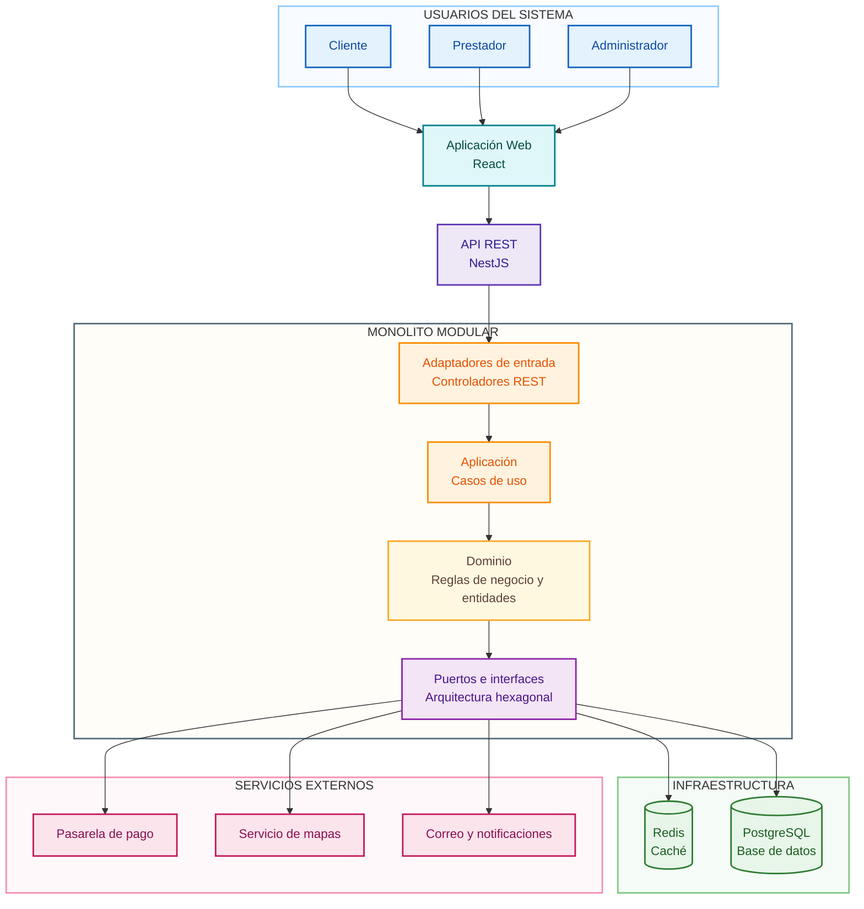
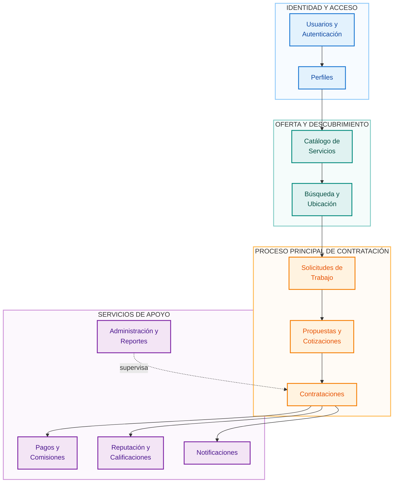
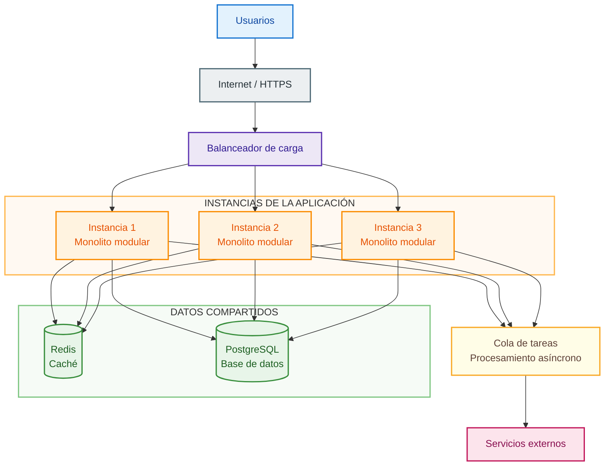
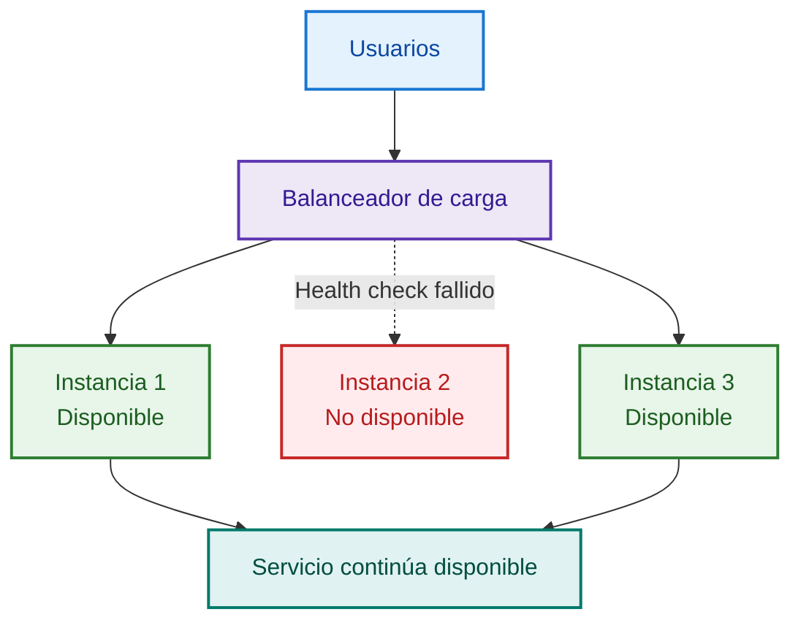
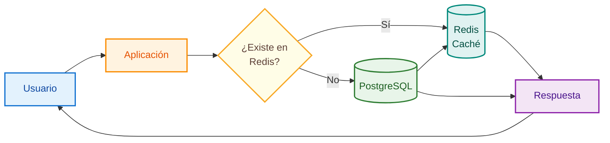
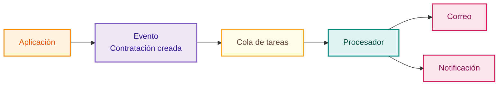
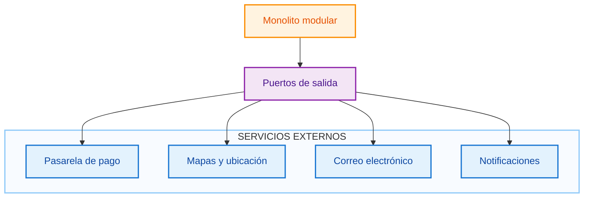

# Análisis de Caso – Arquitectura de Software

## Proyecto

**Plataforma digital para la oferta, búsqueda y contratación de servicios técnicos, profesionales y de oficios en Ayacucho, 2026**

## 1. Arquitectura seleccionada

Para la plataforma se propone una **arquitectura de monolito modular con principios de arquitectura hexagonal**.

La solución se desarrollará inicialmente como una sola aplicación desplegable, pero estará organizada internamente en módulos con responsabilidades claramente definidas.

Esta decisión permite mantener una implementación inicial manejable, evitando la complejidad prematura de una arquitectura basada en microservicios, pero dejando preparada la solución para crecer y evolucionar en el futuro.

La arquitectura busca principalmente:

- Mantener separada la lógica del negocio de las tecnologías externas.
- Facilitar el mantenimiento del sistema.
- Reducir el acoplamiento entre módulos.
- Mejorar el rendimiento de las consultas frecuentes.
- Permitir el crecimiento progresivo de usuarios.
- Mantener disponibles las funcionalidades principales ante fallos parciales.
- Facilitar futuras integraciones.
- Permitir que una futura aplicación móvil utilice el mismo backend.

---

## 2. Objetivos arquitectónicos

Los principales objetivos de la arquitectura son:

1. Organizar la plataforma mediante módulos funcionales claramente definidos.
2. Mantener la lógica del negocio independiente de tecnologías como PostgreSQL, Redis o proveedores externos.
3. Permitir el crecimiento progresivo del sistema mediante escalamiento horizontal.
4. Mejorar el rendimiento mediante mecanismos de caché.
5. Evitar que una falla de servicios secundarios provoque la caída total de la plataforma.
6. Facilitar el mantenimiento, las pruebas y la incorporación de nuevas funcionalidades.

La solución se diseña considerando inicialmente hasta **20 000 usuarios registrados**.

La cantidad real de usuarios concurrentes que podrá soportar la plataforma deberá comprobarse posteriormente mediante pruebas de rendimiento y carga.

---

## 3. Drivers arquitectónicos

Los drivers arquitectónicos representan los factores que influyen directamente en las decisiones de diseño.

| Driver | Necesidad arquitectónica | Decisión relacionada |
|---|---|---|
| Escalabilidad | Permitir crecimiento progresivo de usuarios y solicitudes | Escalamiento horizontal |
| Disponibilidad | Evitar que una sola falla detenga toda la plataforma | Múltiples instancias y balanceo de carga |
| Rendimiento | Mantener búsquedas y consultas rápidas | Redis, índices y optimización de consultas |
| Resiliencia | Continuar operando ante fallos parciales | Desacoplamiento y procesamiento asíncrono |
| Seguridad | Proteger usuarios, datos y operaciones | Autenticación, autorización y HTTPS |
| Mantenibilidad | Facilitar cambios y nuevas funcionalidades | Monolito modular |
| Extensibilidad | Permitir nuevas integraciones y clientes | Puertos e interfaces |
| Integración | Conectar pagos, mapas y notificaciones | Adaptadores externos |

---

# 4. Vista general de la arquitectura

La solución se organiza en cinco zonas principales:

1. Usuarios del sistema.
2. Aplicación cliente.
3. API de entrada.
4. Núcleo del monolito modular.
5. Infraestructura y servicios externos.



### Interpretación

Los usuarios acceden inicialmente mediante una aplicación web desarrollada en React.

La aplicación web se comunica con el backend mediante una API REST.

Dentro del monolito modular se encuentran los casos de uso y las reglas principales del negocio.

La lógica del sistema no deberá depender directamente de PostgreSQL, Redis, la pasarela de pago, los mapas o los servicios de notificación.

Estas tecnologías serán utilizadas mediante puertos, interfaces y adaptadores.

---

# 5. Organización interna del monolito modular

La aplicación estará dividida internamente en módulos funcionales.

Cada módulo tendrá responsabilidades específicas y deberá evitar depender innecesariamente de la implementación interna de otros módulos.



## 5.1 Usuarios y autenticación

Este módulo será responsable de:

- Registro de usuarios.
- Inicio y cierre de sesión.
- Recuperación de acceso.
- Gestión de roles.
- Gestión de permisos.

## 5.2 Perfiles

Gestionará información relacionada con:

- Clientes.
- Prestadores.
- Experiencia.
- Especialidades.
- Ubicación.
- Disponibilidad.
- Información profesional.

## 5.3 Catálogo de servicios

Será responsable de:

- Categorías.
- Subcategorías.
- Servicios publicados.
- Administración del catálogo.

## 5.4 Búsqueda y ubicación

Permitirá:

- Buscar prestadores.
- Buscar servicios.
- Aplicar filtros.
- Consultar ubicación.
- Utilizar información almacenada temporalmente en caché.

## 5.5 Solicitudes de trabajo

Permitirá que los clientes publiquen trabajos indicando información como:

- Descripción.
- Categoría.
- Ubicación.
- Fecha.
- Requerimientos adicionales.

## 5.6 Propuestas y cotizaciones

Permitirá a los prestadores enviar propuestas asociadas a las solicitudes publicadas.

Las propuestas podrán incluir:

- Precio.
- Descripción.
- Condiciones.
- Tiempo estimado.
- Disponibilidad.

## 5.7 Contrataciones

Este módulo controlará el proceso principal después de aceptar una propuesta.

Permitirá gestionar estados como:

- Contratado.
- En ejecución.
- Finalizado.
- Cancelado.

## 5.8 Pagos y comisiones

Gestionará:

- Registro de pagos.
- Estado del pago.
- Comisión de la plataforma.
- Integración con pasarelas externas.

## 5.9 Reputación y calificaciones

Permitirá registrar calificaciones y comentarios después de finalizar una contratación.

## 5.10 Notificaciones

Gestionará avisos relacionados con:

- Nuevas propuestas.
- Aceptación de propuestas.
- Cambios de estado.
- Finalización de trabajos.
- Eventos importantes.

## 5.11 Administración y reportes

Permitirá al administrador gestionar:

- Usuarios.
- Categorías.
- Publicaciones.
- Incidencias.
- Contenido reportado.
- Reportes administrativos.

---

# 6. Aplicación de arquitectura hexagonal

La arquitectura hexagonal tiene como objetivo mantener la lógica principal del sistema independiente de tecnologías externas.

Dentro del núcleo se encuentran las reglas del negocio y los casos de uso.

Las tecnologías externas se conectarán mediante adaptadores.

```mermaid
flowchart LR

    ENTRADA["Adaptador de entrada<br/>API REST"]

    CASO["Caso de uso<br/>Procesar contratación"]

    DOMINIO["Dominio<br/>Reglas del negocio"]

    PUERTO["Puerto<br/>Procesar pago"]

    ADAPTADOR["Adaptador de pago"]

    PROVEEDOR["Proveedor externo<br/>Pasarela de pago"]

    ENTRADA --> CASO
    CASO --> DOMINIO
    DOMINIO --> PUERTO
    PUERTO --> ADAPTADOR
    ADAPTADOR --> PROVEEDOR


    classDef entrada fill:#E3F2FD,stroke:#1976D2,color:#0D47A1,stroke-width:2px;
    classDef core fill:#FFF3E0,stroke:#FB8C00,color:#E65100,stroke-width:2px;
    classDef port fill:#F3E5F5,stroke:#8E24AA,color:#4A148C,stroke-width:2px;
    classDef adapter fill:#E8F5E9,stroke:#43A047,color:#1B5E20,stroke-width:2px;
    classDef external fill:#FCE4EC,stroke:#D81B60,color:#880E4F,stroke-width:2px;

    class ENTRADA entrada;
    class CASO,DOMINIO core;
    class PUERTO port;
    class ADAPTADOR adapter;
    class PROVEEDOR external;
```



Por ejemplo, la lógica central del sistema no debería depender directamente de una empresa específica de pagos.

El dominio solicitará una operación mediante un puerto como:

```text
ProcesarPago()
```

Un adaptador será responsable de comunicarse con el proveedor externo correspondiente.

Si posteriormente se cambia de proveedor, la lógica principal de contratación podrá mantenerse sin modificaciones significativas.

---

# 7. Vista de despliegue y escalabilidad

La primera versión del sistema podrá utilizar una sola instancia del backend.

Cuando aumente la demanda, podrán agregarse nuevas instancias del mismo monolito modular.

Un balanceador de carga distribuirá las solicitudes entre las instancias disponibles.



## Escalamiento horizontal

El crecimiento de la plataforma se realizará principalmente mediante **escalamiento horizontal**.

Esto significa que, en lugar de depender únicamente de un servidor más potente, podrán agregarse nuevas instancias de la aplicación cuando la demanda aumente.

Ejemplo:

```text
1 instancia
      ↓
aumenta la demanda
      ↓
2 instancias
      ↓
aumenta nuevamente
      ↓
3 o más instancias
```

El balanceador será responsable de distribuir las solicitudes entre las instancias disponibles.

---

# 8. Alta disponibilidad y resiliencia

La arquitectura busca reducir el riesgo de que una falla aislada provoque la caída completa de la plataforma.

Cuando exista más de una instancia, el balanceador podrá evitar enviar nuevas solicitudes hacia una instancia que no se encuentre disponible.



La alta disponibilidad no significa que un sistema nunca pueda fallar.

El objetivo es reducir los puntos únicos de falla y permitir que las funciones principales continúen operando ante determinados fallos parciales.

También se aplicará resiliencia frente a servicios secundarios.

Por ejemplo, si temporalmente falla el servicio de correo, la búsqueda de prestadores no debería dejar de funcionar.

---

# 9. Estrategia de caché

Se propone utilizar **Redis** para almacenar temporalmente información consultada frecuentemente.

El flujo será el siguiente:



## Datos candidatos para caché

Entre los datos que podrían almacenarse temporalmente se encuentran:

- Categorías.
- Subcategorías.
- Configuraciones generales.
- Información pública consultada frecuentemente.
- Determinados resultados reutilizables de búsqueda.

No toda la información deberá almacenarse en caché.

La información crítica o altamente cambiante deberá consultarse directamente desde la fuente correspondiente cuando sea necesario.

---

# 10. Procesamiento asíncrono

Algunas tareas no necesitan ejecutarse antes de responder al usuario.

Por ejemplo:

- Envío de correos.
- Algunas notificaciones.
- Generación de reportes.
- Procesos secundarios posteriores a una contratación.

Estas operaciones podrán utilizar procesamiento asíncrono.



Esto permitirá evitar que operaciones secundarias aumenten innecesariamente el tiempo de respuesta de las operaciones principales.

---

# 11. Rendimiento

Como objetivo inicial, las búsquedas y consultas frecuentes deberán responder en un tiempo aproximado no mayor a **3 segundos en condiciones normales de operación**.

Las principales estrategias consideradas son:

- Redis como caché.
- Índices en PostgreSQL.
- Paginación de resultados.
- Optimización de consultas.
- Procesamiento asíncrono.
- Escalamiento horizontal.
- Monitoreo del rendimiento.

El rendimiento real deberá comprobarse posteriormente mediante pruebas de carga.

---

# 12. Seguridad

La arquitectura deberá proteger la información y las operaciones de los usuarios.

Se consideran las siguientes medidas:

- Autenticación mediante tokens.
- Autorización basada en roles y permisos.
- Almacenamiento seguro de contraseñas mediante hash.
- HTTPS para comunicaciones.
- Validación de datos de entrada.
- Rate limiting.
- Protección de endpoints.
- Registro de operaciones críticas.
- Control de acceso administrativo.
- Manejo seguro de secretos y credenciales.

---

# 13. Observabilidad y monitoreo

La plataforma deberá registrar información suficiente para identificar problemas de operación.

Se consideran:

- Registro de errores.
- Registro de eventos relevantes.
- Monitoreo del estado de las instancias.
- Health checks.
- Medición de tiempos de respuesta.
- Monitoreo del uso de recursos.
- Alertas ante fallos críticos.

La observabilidad permitirá detectar problemas antes de que afecten significativamente a los usuarios.

---

# 14. Persistencia de datos

Se propone **PostgreSQL** como base de datos principal.

Almacenará información relacionada con:

- Usuarios.
- Perfiles.
- Categorías.
- Servicios.
- Solicitudes.
- Propuestas.
- Contrataciones.
- Pagos.
- Comisiones.
- Calificaciones.
- Incidencias.
- Historial.

También deberán considerarse mecanismos de respaldo y recuperación de la información.

---

# 15. Servicios externos

La plataforma podrá integrarse con diferentes proveedores externos.



Las integraciones deberán utilizar interfaces para evitar que la lógica principal dependa directamente de un proveedor específico.

---

# 16. Tecnologías propuestas

| Componente | Tecnología propuesta |
|---|---|
| Frontend | React |
| Backend | Node.js + NestJS |
| API | REST |
| Base de datos | PostgreSQL |
| Caché | Redis |
| Autenticación | JWT |
| Documentación API | Swagger / OpenAPI |
| Contenedores | Docker |
| Control de versiones | Git y GitHub |

Estas tecnologías representan una propuesta inicial.

La arquitectura deberá permitir sustituir determinados componentes tecnológicos sin modificar innecesariamente la lógica principal del sistema.

---

# 17. Decisiones arquitectónicas principales

## Monolito modular en lugar de microservicios

Se selecciona un monolito modular porque la primera versión del proyecto no necesita asumir desde el inicio la complejidad operativa de una arquitectura de microservicios.

La modularidad permitirá mantener separadas las responsabilidades y facilitar una posible evolución futura.

## Principios de arquitectura hexagonal

Se utilizan para mantener la lógica principal independiente de bases de datos, proveedores y frameworks externos.

## PostgreSQL

Se propone como base de datos principal por la naturaleza estructurada y relacional de gran parte de la información manejada por la plataforma.

## Redis

Se utiliza como mecanismo de caché para reducir consultas repetitivas y mejorar el tiempo de respuesta.

## API REST

Permitirá separar el frontend del backend y facilitar que posteriormente otros clientes, como una aplicación móvil, puedan utilizar los mismos servicios.

## Escalamiento horizontal

Permitirá incrementar la capacidad agregando nuevas instancias de la aplicación cuando la demanda aumente.

---

# 18. Riesgos arquitectónicos

| Riesgo | Impacto | Estrategia |
|---|---|---|
| Crecimiento inesperado de usuarios | Saturación del backend | Escalamiento horizontal |
| Exceso de consultas a la base de datos | Degradación del rendimiento | Redis e índices |
| Falla de una instancia | Pérdida parcial del servicio | Balanceador y múltiples instancias |
| Falla de notificaciones | Pérdida temporal de avisos | Procesamiento asíncrono |
| Falla de proveedor de pagos | Imposibilidad temporal de procesar pagos | Adaptadores desacoplados |
| Consultas de búsqueda costosas | Respuesta lenta | Caché, filtros, índices y paginación |
| Acoplamiento entre módulos | Mantenimiento complejo | Monolito modular |
| Dependencia tecnológica | Dificultad para cambiar proveedores | Arquitectura hexagonal |

---

# 19. Evolución futura

La arquitectura deberá permitir que el sistema evolucione progresivamente.

Entre las posibles evoluciones se consideran:

- Aplicación móvil.
- Nuevas zonas geográficas.
- Nuevas categorías de servicios.
- Recomendaciones personalizadas.
- Verificación avanzada de identidad.
- Nuevos proveedores de pago.
- Nuevos mecanismos de notificación.
- Extracción de módulos específicos si el crecimiento futuro lo justifica.

Una posible migración hacia microservicios no se realizará de forma anticipada.

Solo se considerará si existen necesidades técnicas u operativas reales que justifiquen aumentar la complejidad del sistema.

---

# 20. Conclusión

La arquitectura propuesta utiliza un **monolito modular con principios de arquitectura hexagonal**.

Esta combinación permite mantener una solución inicialmente manejable y al mismo tiempo proporcionar una estructura preparada para crecer.

La división interna en módulos facilita la mantenibilidad y reduce el acoplamiento.

La arquitectura hexagonal permite mantener la lógica principal separada de tecnologías externas.

Redis permitirá mejorar el rendimiento de información consultada frecuentemente, mientras que PostgreSQL actuará como almacenamiento principal.

El balanceo de carga y el escalamiento horizontal permitirán aumentar la capacidad cuando la demanda lo requiera.

Finalmente, la arquitectura busca que la plataforma pueda evolucionar de forma progresiva sin requerir un rediseño completo de su lógica principal.